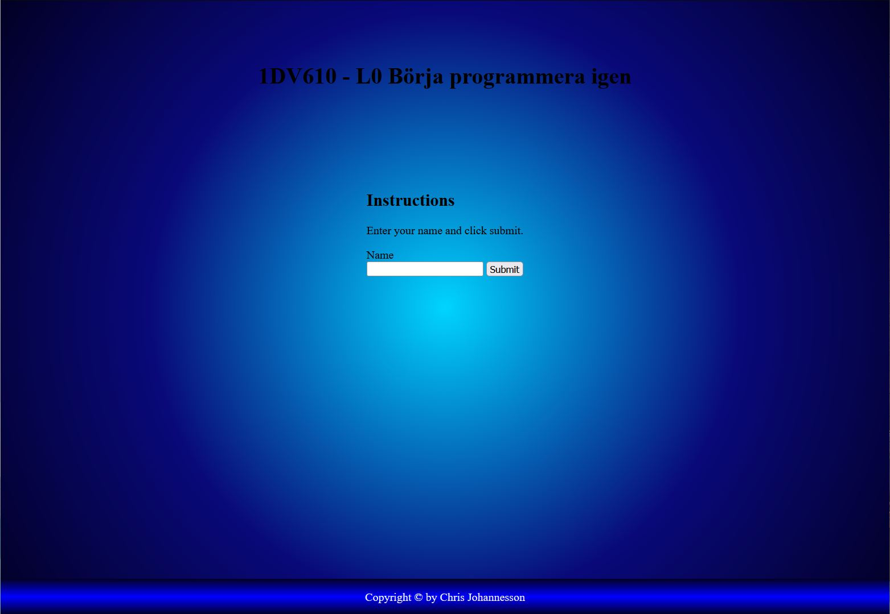
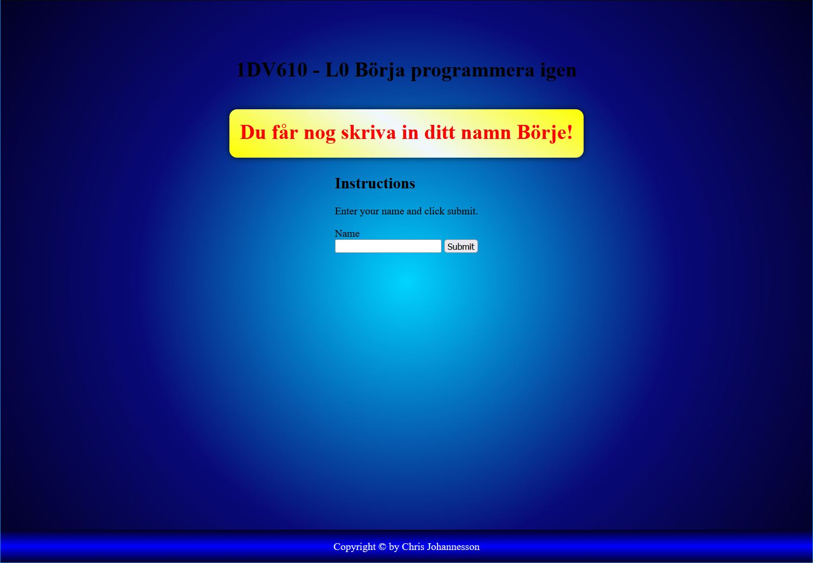
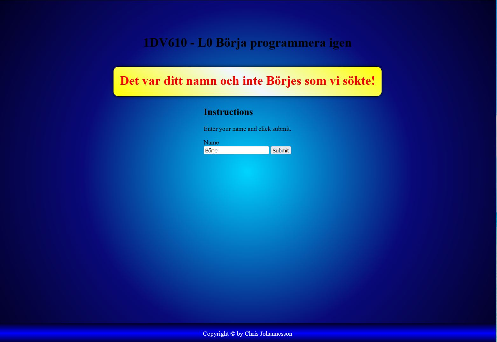
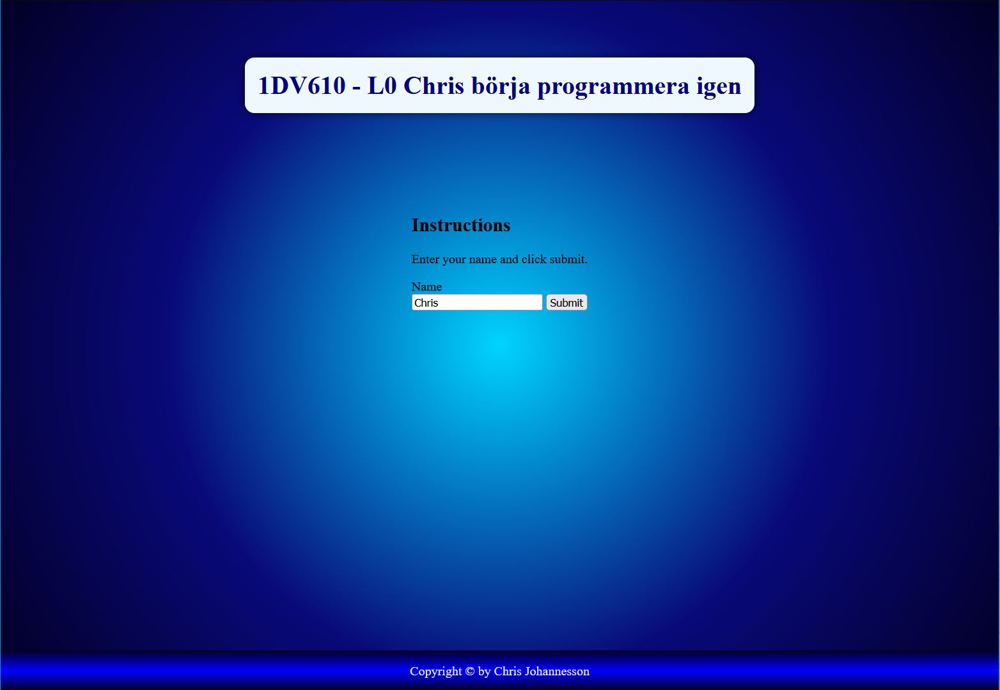

# 610_L0 Start Programming

## Instructions

The project is supposed to run with a development server or any other server you want that handles an index.html file.
I'm using php development server or Live server in VSCode.

Then follow the instructions or be a bad boy and don't!

## Screen shots

### Screen 1

### Screen 2

### Screen 3

### Screen 4

## Video

### Video link YouTube
